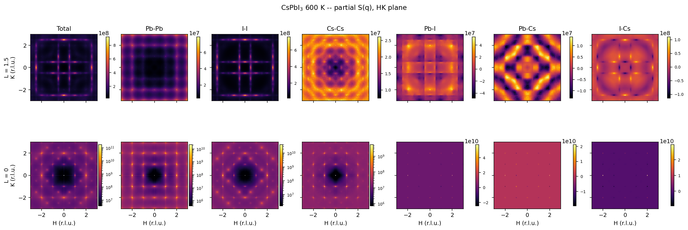
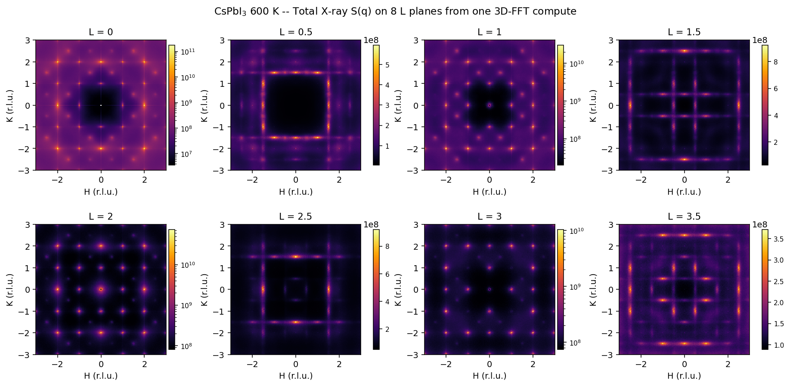
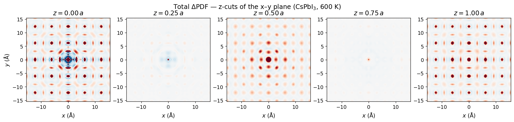
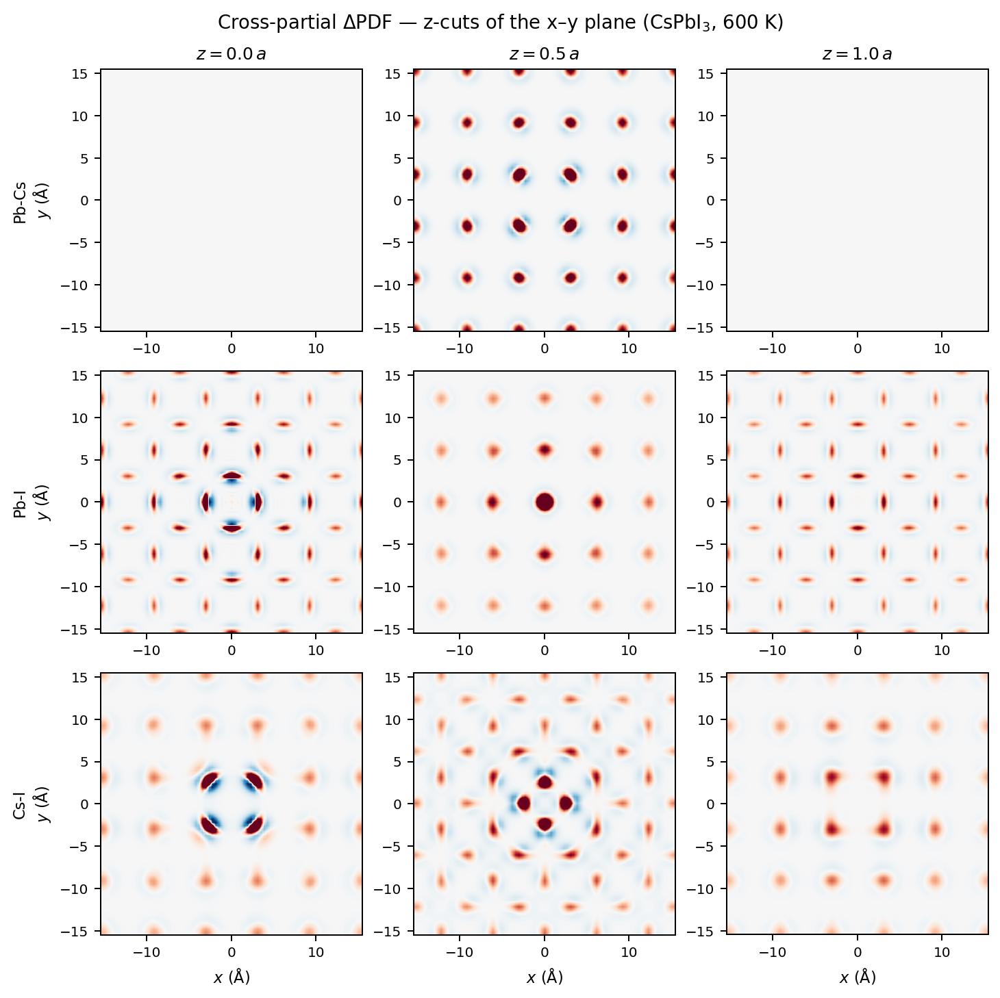
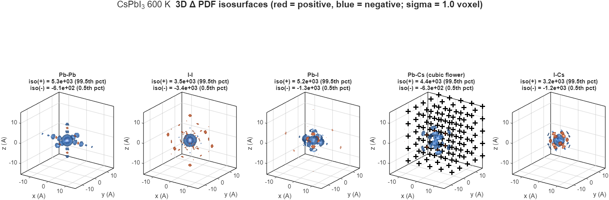
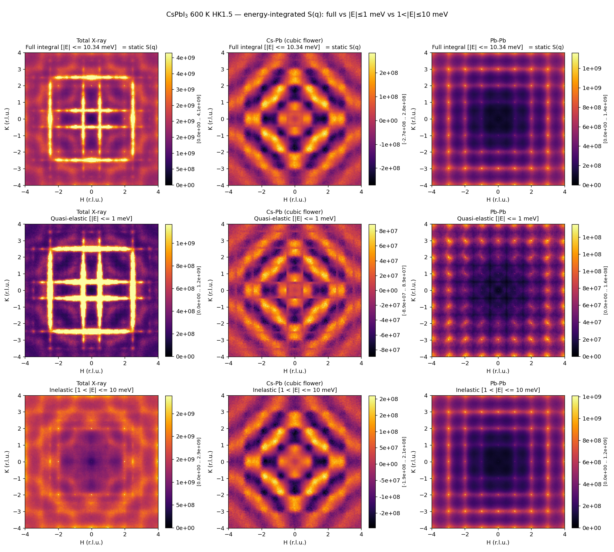
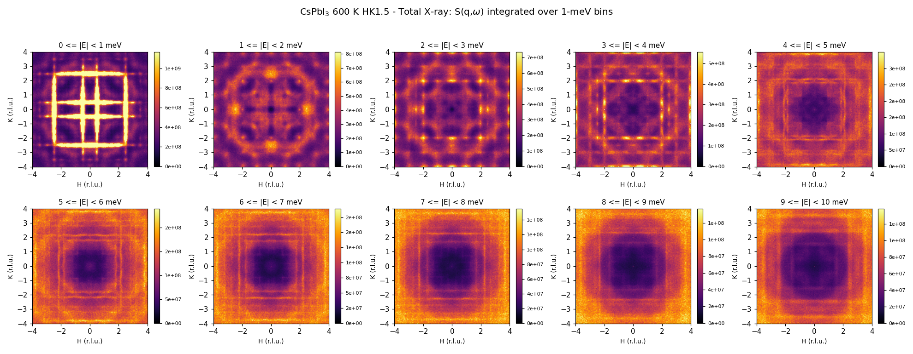
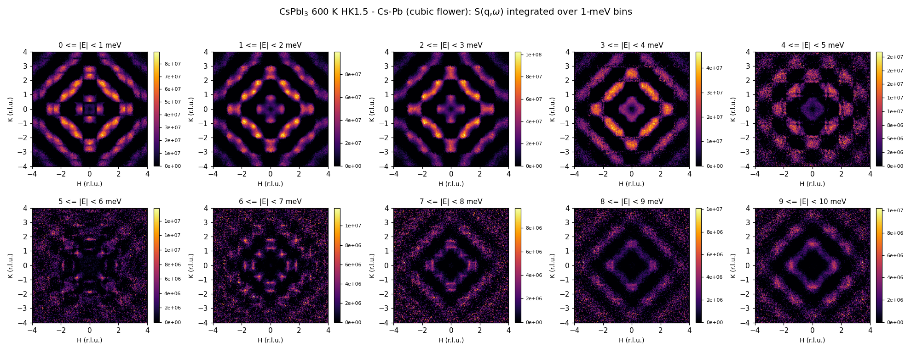
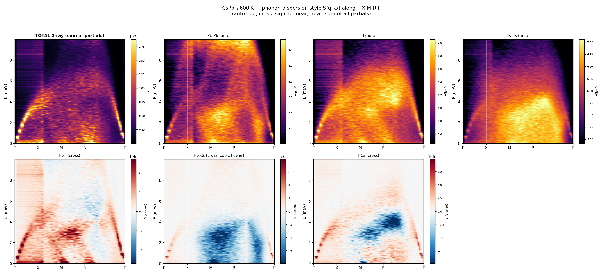

# gpuscatter

**GPU-accelerated diffuse scattering, dynamic structure factor S(q, ω), 3D ΔPDF, and phonon dispersion projection from
molecular-dynamics trajectories.**

A Python package similar in spirit to
[PSF](https://github.com/tyst3273/pynamic-structure-factor) 
and [dynasor v2](https://gitlab.com/materials-modeling/dynasor), but built on **CuPy + cuFFT** for an
~50–500× speedup over single-CPU baselines, and adds three capabilities
those tools don't currently offer:

1. **Full 3D S(q) cube**: every reciprocal-space plane in one
   calculation, returned per atom-pair. The user picks the simulation
   supercell size and the number of voxels per unit cell; together
   they fix the q-step and q_max of the resulting cube. Computed by
   density-binning followed by a 3D rFFT, rather than the direct
   atomic Fourier sum used by other tools.
2. **3D-ΔPDF** per atom-pair: inverse FFT
   of each Bragg-subtracted partial. The Patterson function is the
   autocorrelation of the scattering density, so each peak in the map
   sits on an inter-atomic vector; the ΔPDF is processed on the data with
   average-crystal lattice Bragg peaks removed, leaving exactly the
   real-space displacement correlations that the full PDF buries under
   Bragg peaks.
3. **BZ-folded S(q, ω) for phonon-dispersion projection** along
   arbitrary paths in Brillouin zone (BZ). S(q, ω) is computed once on the
   first BZ (one q-point per simulation-supercell unit
   cell) via direct atomic Fourier sum, and any user path is then
   taken as a 2D slice through the resulting 4D cube.

## Highlights

| Feature | Method | Wall time on GTX 1070 (5001 frames) |
|---|---|---:|
| Full 3D static S(q) cube (192³) | density-binning + 3D rFFT | **1.7 min** (all 97 unique L-planes at once) |
| 3D ΔPDF per partial | iFFT of Bragg-subtracted S(q) | **< 5 s** |
| Dynamic S(q, ω) on HK plane | direct atomic FT + cuFFT batched 1D FFT | **20 min** |
| Full first-BZ S(q, ω), 24³ × 2501 ω-bins | direct atomic FT + cuFFT | **11 min** |
| Phonon dispersion along Γ-X-M-R-Γ | path projection on BZ cube | **< 5 s** |

For comparison, the same calculations on a single CPU using `dynasor v2`
or `PSF` take ~5 hours (S(q, ω)) or ~34 hours (full 3D S(q) cube).

## Install

```bash
git clone https://github.com/dubajicmilos/gpuscatter
cd gpuscatter
pip install -e .
```

You need a CUDA-capable GPU and a matching CuPy build:

```bash
pip install cupy-cuda12x      # for CUDA 12.x
# or: cupy-cuda11x for CUDA 11.x
```

## Quick start

```python
from pathlib import Path
from gpuscatter import (
    NpzTrajectory,
    Sq3D, Sq3DConfig,
    Sqw, SqwConfig, make_qgrid_HK_plane, make_qgrid_BZ,
    compute_delta_pdf,
    DispersionProjection, HIGH_SYMMETRY_POINTS_CUBIC,
)

# Load a Baldwin-style multi-NPZ trajectory.
files = sorted(Path('600K/').glob('nptraj*.npz'))
traj = NpzTrajectory(files)              # 5001 frames, 69 120 atoms
a_cub = traj.L_box / 24

# 1) Full 3D static S(q) cube (1.7 min on GTX 1070, all L-planes at once)
# n_voxels_per_cell=8 -> q_Nyq = 4 r.l.u.; trust signal up to
# sq.q_max_clean ~ 3.4 r.l.u. -- see "q_Nyquist edge artifact" below.
# sub_regions=8, sub_region_cells=8 averages 8 random 8^3-cell sub-cubes
# of the 24^3 box to suppress long-vector finite-size Fourier ripples;
# pass sub_regions=1 (and drop sub_region_cells) for a single full-box
# compute that is faster but ripplier.
sq = Sq3D(traj, Sq3DConfig(n_cells=24, n_voxels_per_cell=8,
                            sub_regions=8, sub_region_cells=8)).run()
sq.save('sq3d_600K.npz')

# Same with neutron weighting (b is q-independent, NIST table built in)
sq_n = Sq3D(traj, Sq3DConfig(n_cells=24, n_voxels_per_cell=8,
                              sub_regions=8, sub_region_cells=8,
                              weighting='neutron')).run()
sq_n.save('sq3d_600K_neutron.npz')

# 2) 3D delta-PDF per partial (< 5 s)
pdf = compute_delta_pdf(sq)
pdf.save('delta_pdf_600K.npz')

# 3) Dynamic S(q, omega) on the HK1.5 plane (20 min)
h, q_vecs, _ = make_qgrid_HK_plane(L_value=1.5, a_cub=a_cub)
sqw = Sqw(traj, SqwConfig(q_vecs=q_vecs, dt_fs=200.0)).run()
sqw.save('sqw_HK15_600K.npz')

# 4) Phonon dispersion along Gamma-X-M-R-Gamma (~11 min for the BZ cube)
q_red_1d, q_red, q_cart, _ = make_qgrid_BZ(24, a_cub)
sqw_bz = Sqw(traj, SqwConfig(q_vecs=q_cart, dt_fs=200.0)).run()
proj = DispersionProjection(
    S_qw=sqw_bz.total.reshape(24, 24, 24, -1),
    q_grid_shape=(24, 24, 24),
    E_axis_meV=sqw_bz.E_axis_meV,
)
S_path, q_red_path, breaks = proj.project(['Gamma', 'X', 'M', 'R', 'Gamma'])
```

For runnable end-to-end scripts see [`examples/`](examples/).

## Demo: CsPbI₃ at 600 K

The headline demo uses **5001 frames** (1 ns total at 200 fs frame
spacing) of a **24 × 24 × 24 cubic supercell** of **CsPbI₃ at 600 K**
(69 120 atoms, lattice constant a = 6.19 Å, cubic edge L = 148.5 Å)
from the [Baldwin et al. (2024)](https://doi.org/10.1002/smll.202303565)
ACE-MLIP trajectory. The 24-cell side fixes the q-resolution at
1/24 r.l.u. (~0.042 Å⁻¹) on every output, and the 1 ns total time gives
~4 µeV energy resolution on S(q, ω). CsPbI₃ at 600 K is in the cubic
phase, 67 K above the cubic→tetragonal transition at T_c ≈ 533 K, so
its diffuse-scattering landscape contains all the characteristic
features of a halide perovskite near a tilt-driven structural
transition:

* a soft tilt mode at the **R-point** (BZ corner, q = (½, ½, ½) r.l.u.)
  producing rod-like X–X scattering at half-integer L,
* a broadband **Cs–Pb cubic flower** (a 4mm-symmetric four-petal
  feature in the Cs-Pb partial S(q)) at the BZ edges of half-integer L,
  reflecting acoustic-elastic coupling through the halide framework,
* sharp **Pb-Pb integer-Q acoustic-phonon TDS** (thermal diffuse
  scattering off acoustic phonons) dispersing from Γ (BZ centre).

### 3D static S(q): all 97 L-planes in one shot

`gpuscatter.Sq3D` produces the full 3D X-ray-weighted partial S(q) cube
on a 192³ q-grid (step 1/24 r.l.u., q_max = 4 r.l.u.) in **1.7 min on a
GTX 1070**. All seven channels (Pb-Pb, I-I, Cs-Cs, Pb-I, Pb-Cs, I-Cs,
total) are produced in the same compute.



Eight L-planes from the same single 1.7-min compute:



3D isosurface rendering of the partial S(q) cube
(full cube `H, K, L ∈ [-1.75, +1.75]` r.l.u., 91st-percentile isovalue;
orange = positive, blue inner surface = negative lobes of the cross partials):


For comparison, computing the same eight L-planes via direct atomic
Fourier sum (numba JIT, single L plane at a time) on the same hardware
would take ~3 h. Computing the full 97-plane cube would take ~34 h.

#### Caveat: q_Nyquist edge artifact

Any density-binning + FFT pipeline produces a **bright band on the outer
~10–15 % of the q-grid**, at the voxel-grid Nyquist frequency
`q_Nyq = n_voxels_per_cell / 2 r.l.u.` per axis. Three causes compound
there: (i) high-q signal aliases across `q_Nyq`; (ii) the `1/sinc⁴`
deconvolution of the CIC (cloud-in-cell) deposition kernel boosts by
6× per axis at the boundary, 226× at the cube corner, exactly where
the aliased contamination lives; (iii) the form factor and the bare
diffuse intensity are still substantial up there.

**Recommended use**:

* Pick `n_voxels_per_cell ≥ 2.4 · q_max` for the highest q you actually
  want to analyse. For `q_max = 4 r.l.u.` (typical halide perovskite),
  set `n_voxels_per_cell = 10`. For `q_max = 5 r.l.u.`, use 12.
* **Drop the contaminated outer band** with `result.trim()` before
  saving or plotting. It cuts the cube to
  `|q| ≤ result.q_max_clean = 0.85 · q_Nyq` by default; pass
  `q_max=...` for a custom cut. (`Sq3D.run()` itself returns the full
  grid so you still have access to the edge if you want to inspect it.)
* The 2D direct atomic Fourier sum on a fixed `(H, K, L)` plane does
  *not* have this artifact, since it evaluates the FT exactly at user
  q-points without binning or deconvolution. Use `Sqw` with
  `make_qgrid_HK_plane` (then integrate over ω if you want the static
  partial) for a clean image of one specific plane up to high q.


### 3D ΔPDF

The inverse 3D FFT of each Bragg-subtracted partial S(q) gives the
3D-ΔPDF. The figures below use a finer compute
(`n_voxels_per_cell = 16`, dx_real ≈ 0.39 Å) than the Sq3D demo above
so that the real-space features come out sharp.

Total ΔPDF sliced through the x-y plane at `z = 0`, `a/4`, `a/2`,
`3a/4`, `a`. The first and last panel coincide by lattice periodicity:



Three cross-partial ΔPDFs at `z = 0` (Cs corners and in-plane I face
sites), `z = a/2` (Pb body-centres and out-of-plane I face sites),
and `z = a` (≡ z = 0 by periodicity). The Pb-Cs cubic flower lives
entirely on the `z = a/2` plane: a 4mm-symmetric pattern of positive
peaks at every `(±a/2, ±a/2)` Cs body-centre site (NN distance
`√3·a/2 ≈ 5.4 Å`), the real-space image of the Pb-Cs displacement
correlations along ⟨111⟩ that produce the cubic flower in q-space.



3D dual-isosurface render of five partials, with one positive (red)
and one negative (blue) iso level per partial:




### Dynamic S(q, ω): the soft-tilt mode and energy decomposition

`gpuscatter.Sqw` computes the dynamic structure factor on any user q-set.
On the HK1.5 plane (161 × 161 = 25 921 q-points × 5001 frames), wall
time is **20 min on a GTX 1070** vs ~5 h with single-CPU dynasor v2.

Energy-integrated S(q) maps in three complementary windows:



* **Quasi-elastic (|E| < 1 meV)**: the **R-rod cross at half-integer Q**
  dominates → overdamped soft tilt mode, FWHM ≈ 0.5 meV → relaxation
  τ ≈ 1.3 ps.
* **Inelastic (1 < |E| < 10 meV)**: integer-Q Bragg residuals
  (acoustic-phonon TDS) and the **broadband Cs-Pb cubic flower** persist,
  confirming the flower is acoustic-elastic, not pure soft-mode.
* **Total**: sum-rule check; equals the static S(q) by `∫S(q,ω)dω = S(q)`.

S(q) maps at fixed energy slices:



Same decomposition for the Cs-Pb cubic-flower partial:



### Phonon dispersion along Γ–X–M–R–Γ

The full first-BZ S(q, ω) computation (24³ q × 2501 ω-bins, 11 min on
GTX 1070) feeds the `DispersionProjection` module, which extracts
2D dispersion sheets along the high-symmetry path:




## What gpuscatter is **not**

* It is not a force-constant lattice-dynamics code (use `phonopy`,
  `phono3py`, `lammps-pair`).
* It does not extract phonon eigenvectors directly; it gives the
  signed cross structure factor `Re[F_a F_b*]`, which contains both
  eigenvector character and kinematic structure-factor phase. Eigenvectors
  need a separate force-constant calculation.


## How it compares to existing tools

| Tool | Backend | 3D S(q) | 3D-ΔPDF | S(q,ω) | Phonon proj. | License |
|---|---|---|---|---|---|---|
| **gpuscatter** | **CuPy + cuFFT** | **✓ (3D rFFT)** | **✓** | ✓ | ✓ | MIT |
| dynasor v2 | numba | direct sum (1 plane) | ✗ | ✓ | ✓ | LGPL |
| PSF | numba + multiproc | direct sum (1 plane) | ✗ | ✓ | ✓ | MIT |
| Yell, DISCUS, ZODS | C++ / Fortran | direct sum (small q) | ✓ | ✗ | ✗ | various |

The key novelty is `gpuscatter`'s **density-binning + 3D rFFT** approach
to 3D static S(q): it changes the asymptotic complexity from
`O(n_atoms × n_q)` (direct sum, what every other tool does) to
`O(n_atoms + N³ log N)` (binning + FFT). For our 600 K demo with
~70 000 atoms × 3.6 M q-points, the asymptotic ratio is ~10×; combined
with the ~10× GPU speedup, the total is ~75× per same-shape compute,
and ~50 000× when you need the full 3D cube instead of a single plane.

## Citing

If you use `gpuscatter` in published work, please cite:

```
@software{gpuscatter,
  author = {Milos Dubajic},
  title  = {gpuscatter: GPU-accelerated diffuse scattering, S(q,ω),
            and 3D-ΔPDF from MD trajectories},
  year   = {2026},
  url    = {https://github.com/dubajicmilos/gpuscatter},
}
```

Plus the methods papers for the underlying algorithms:

* Butler, B. D. & Welberry, T. R.
  [*J. Appl. Cryst.* **25**, 391 (1992)](https://doi.org/10.1107/S0021889891014322):
  direct-sum diffuse calculation.
* Berger, E. et al.
  [*Comp. Phys. Commun.* **316**, 109759 (2025)](https://doi.org/10.1016/j.cpc.2025.109759):
  dynasor v2 algorithms.
* Weber, T. & Simonov, A.
  [*Z. Krist.* **227**, 238 (2012)](https://doi.org/10.1524/zkri.2012.1504):
  3D-ΔPDF formalism.
* Simonov, A. & Goodwin, A. L.
  [*Nat. Rev. Chem.* **4**, 657 (2020)](https://doi.org/10.1038/s41570-020-00228-3):
  3D-ΔPDF review.

## Project layout

```
gpuscatter/
├── gpuscatter/                 # the package
│   ├── __init__.py             # public API
│   ├── form_factors.py         # X-ray Cromer-Mann + neutron lengths
│   ├── trajectory.py           # NpzTrajectory + base class
│   ├── sq3d.py                 # 3D static S(q) by density+rFFT
│   ├── sqw.py                  # Dynamic S(q,ω) by direct sum + cuFFT
│   ├── delta_pdf.py            # 3D delta-PDF
│   └── dispersion.py           # high-sym path projection
├── examples/                   # 5 runnable demo scripts
├── benchmarks/                 # GPU-vs-CPU timing
├── docs/figures/               # plots used in this README
└── tests/
```

## License

MIT. See [LICENSE](LICENSE).
