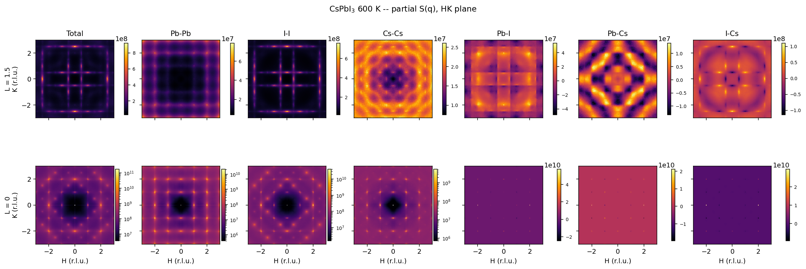
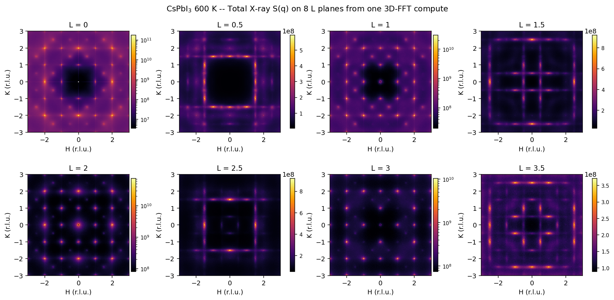
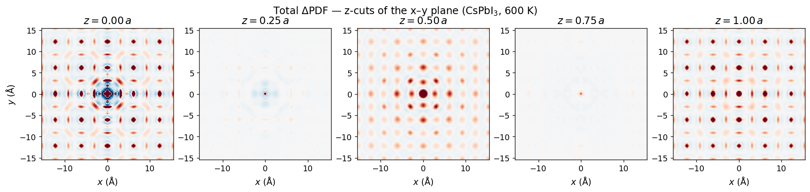
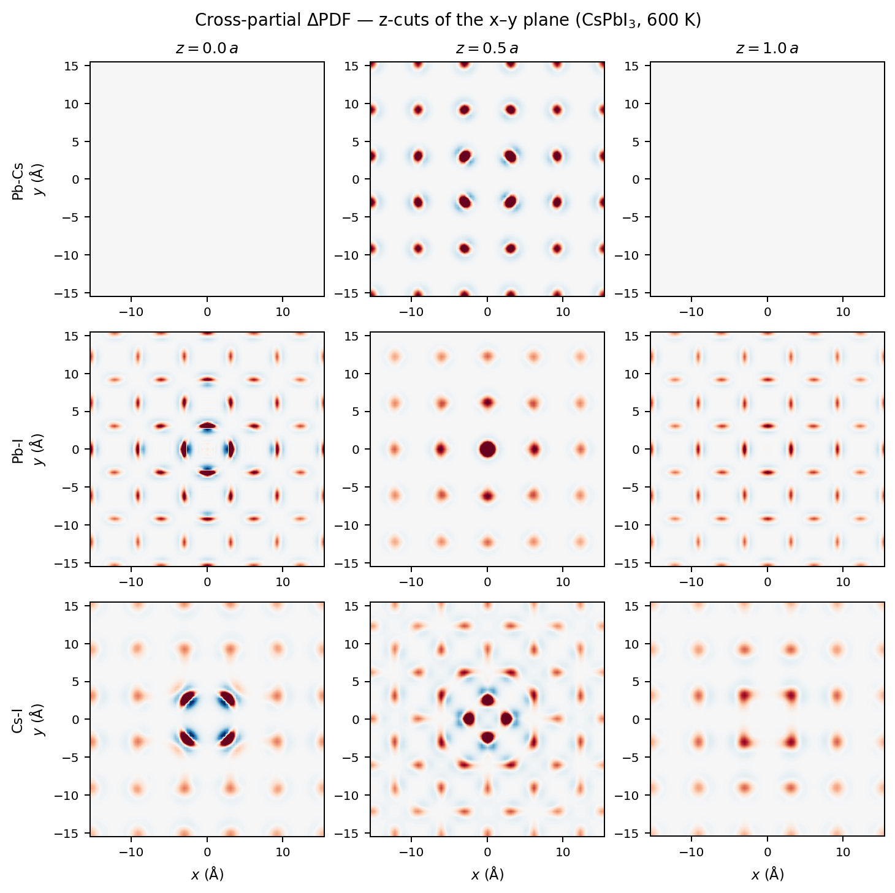
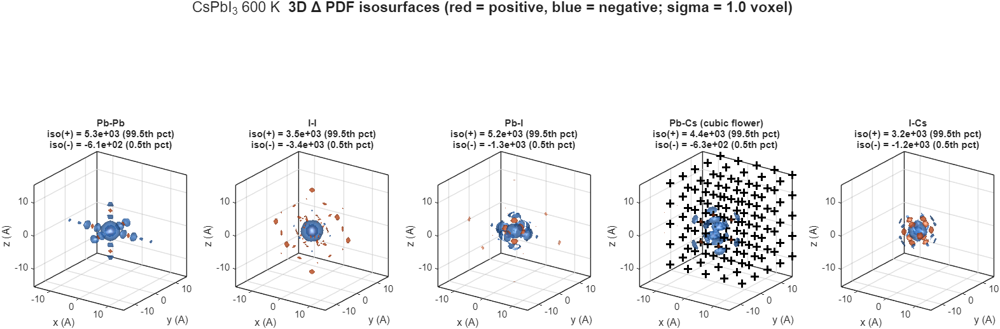
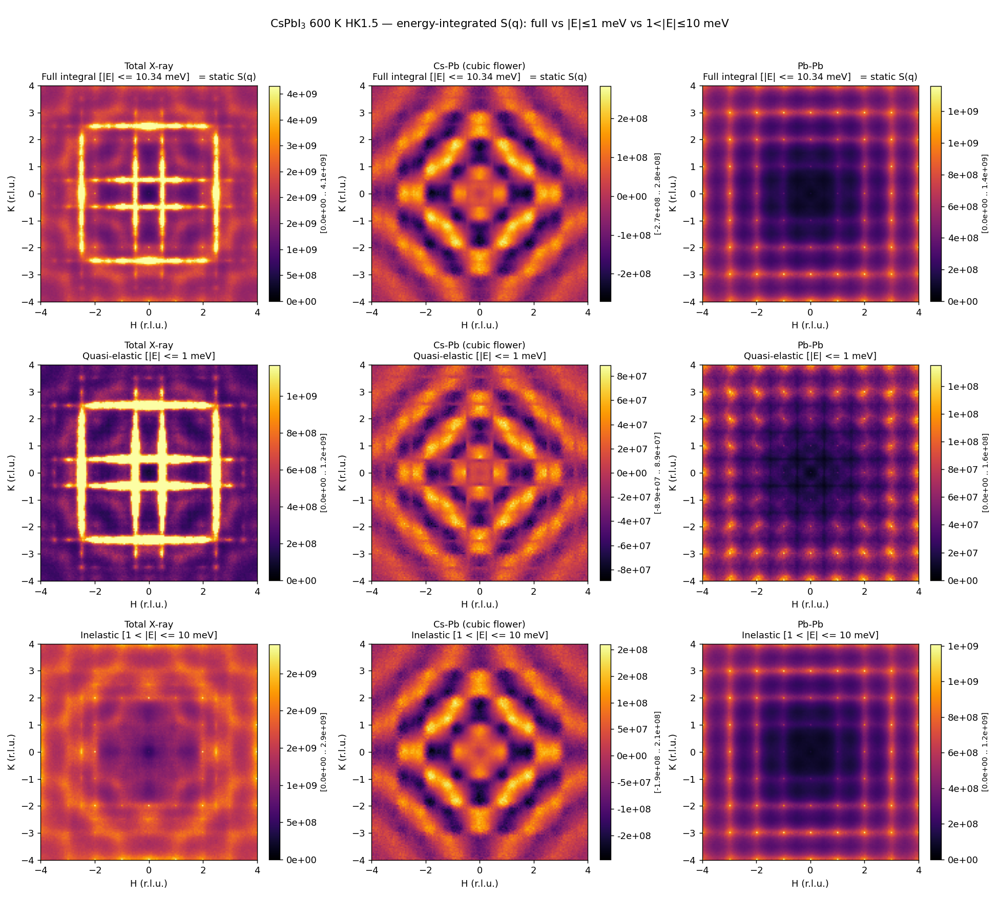
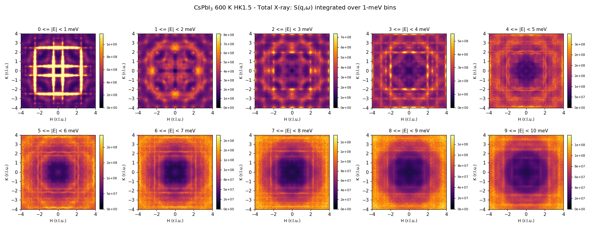
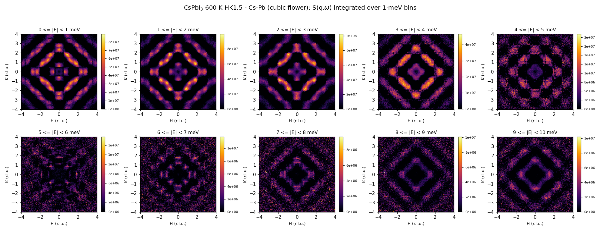
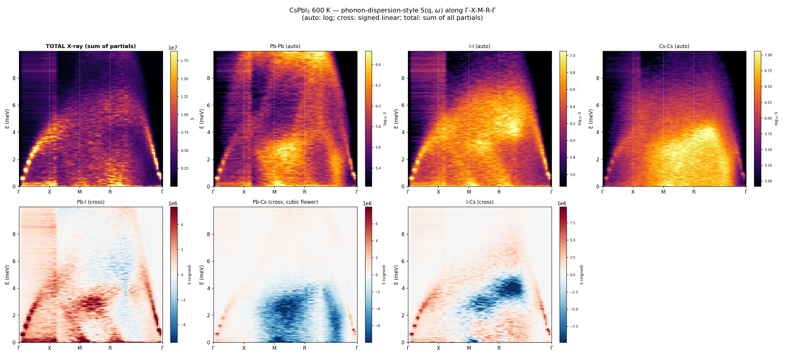
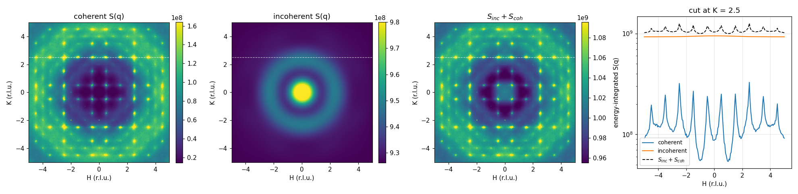

# gpuscatter

GPU-accelerated diffuse scattering, dynamic structure factor S(q, ω), 3D ΔPDF, and phonon dispersion projection from
molecular-dynamics trajectories.

gpuscatter is a Python package that, like
[PSF](https://github.com/tyst3273/pynamic-structure-factor)
and [dynasor v2](https://gitlab.com/materials-modeling/dynasor), computes
scattering functions from molecular-dynamics (MD) trajectories. It is
built on CuPy + cuFFT, which gives an ~50–500× speedup over single-CPU
baselines, and it adds three capabilities that those tools don't
currently offer:

1. Full 3D S(q) cube: every reciprocal-space plane from one
   calculation, returned per atom pair (one partial S(q) for each pair
   of atomic species). The user picks the simulation supercell size and
   the number of voxels per unit cell; together they fix the q-step and
   q_max of the resulting cube. The cube is computed by density binning
   followed by a 3D rFFT, rather than by the direct atomic Fourier sum
   that PSF and dynasor v2 use.
2. 3D-ΔPDF per atom pair: the inverse FFT of each Bragg-subtracted
   partial. The Patterson function is the autocorrelation of the
   scattering density, so each peak in the map sits on an interatomic
   vector. Because the ΔPDF is computed from data with the Bragg peaks
   of the average crystal removed, it isolates the real-space
   displacement correlations that the full PDF buries under the
   contribution of the Bragg peaks.
3. BZ-folded S(q, ω) for phonon-dispersion projection along arbitrary
   paths in the Brillouin zone (BZ). S(q, ω) is computed once on the
   first BZ (one q-point per unit cell of the simulation supercell) by
   a direct atomic Fourier sum. Any path the user chooses is then a 2D
   slice through the resulting 4D (q, ω) cube.

## Recent updates

- 2026-05-30: Laue-group symmetry averaging (`symmetrize_volume`, plus `expand_rfft_L` and `get_symmetry_operations`) for the seven signed-permutation Laue groups (`-1, 2/m, mmm, 4/m, 4/mmm, m-3, m-3m`). Orbit-averaging a 3D S(q) cube on its own q-grid folds together the N_ops crystallographically equivalent copies of each voxel, which cuts the per-voxel `<|F|²>` noise by up to √N_ops. No interpolation is needed, because each operation is a signed permutation of `(h, k, l)`.
- 2026-05-29: Neutron incoherent S(q, ω) (`SqwConfig(calc_incoherent=True)`; total only; neutron weighting only), plus an optional `subtract_bragg` switch that now defaults to off, so the default output is total scattering including Bragg peaks.
- 2026-05-27: S(q, ω) now folds negative frequencies onto positive ones, for a sqrt(2) gain in signal-to-noise ratio per frequency bin. Sq3D moved to float64/complex128 accumulators to protect the precision of the Bragg subtraction, and the BZ-grid index mapping in the dispersion projection was fixed.
- 2026-05-26: Sqw gained species grouping and automatic chunking to fit the available GPU memory (VRAM); the trajectory loaders gained streaming and binary trajectory I/O.
- 2026-05-16: Form-factor tables extended to 65 elements, including the 3d transition metals.
- 2026-05-08: Documented the Sq3D q_Nyquist edge artifact and added the `q_max_clean` property and `Sq3DResult.trim()` to drop the aliased edge band.
- 2026-05-07: Initial release (v0.1.0), with neutron weighting added for Sq3D and Sqw.

## Highlights

| Feature | Method | Wall time on GTX 1070 (5001 frames) |
|---|---|---:|
| Full 3D static S(q) cube (192³) | density-binning + 3D rFFT | 1.7 min (all 97 unique L-planes at once) |
| 3D ΔPDF per partial | iFFT of Bragg-subtracted S(q) | < 5 s |
| Dynamic S(q, ω) on HK plane | direct atomic FT + cuFFT batched 1D FFT | 20 min |
| Full first-BZ S(q, ω), 24³ × 2501 ω-bins | direct atomic FT + cuFFT | 11 min |
| Phonon dispersion along Γ-X-M-R-Γ | path projection on BZ cube | < 5 s |

For comparison, a direct atomic Fourier sum on a single CPU, the method
used by `dynasor v2` and `PSF`, takes ~5 hours for S(q, ω) on the HK
plane and ~34 hours for the full 3D S(q) cube.

## Install

```bash
git clone https://github.com/dubajicmilos/gpuscatter
cd gpuscatter
pip install -e .
```

You need a CUDA-capable GPU and a matching CuPy build:

```bash
pip install cupy-cuda12x      # for CUDA 12.x
# or: cupy-cuda11x for CUDA 11.x
```

## Quick start

```python
from pathlib import Path
from gpuscatter import (
    NpzTrajectory,
    Sq3D, Sq3DConfig,
    Sqw, SqwConfig, make_qgrid_HK_plane, make_qgrid_BZ,
    compute_delta_pdf,
    DispersionProjection, HIGH_SYMMETRY_POINTS_CUBIC,
)

# Load a Baldwin-style multi-NPZ trajectory.
files = sorted(Path('600K/').glob('nptraj*.npz'))
traj = NpzTrajectory(files)              # 5001 frames, 69 120 atoms
a_cub = traj.L_box / 24

# 1) Full 3D static S(q) cube (1.7 min on GTX 1070, all L-planes at once)
# n_voxels_per_cell=8 -> q_Nyq = 4 r.l.u.; trust signal up to
# sq.q_max_clean ~ 3.4 r.l.u. -- see "q_Nyquist edge artifact" below.
# sub_regions=8, sub_region_cells=8 averages 8 random 8^3-cell sub-cubes
# of the 24^3 box to suppress long-vector finite-size Fourier ripples;
# pass sub_regions=1 (and drop sub_region_cells) for a single full-box
# compute that is faster but ripplier.
sq = Sq3D(traj, Sq3DConfig(n_cells=24, n_voxels_per_cell=8,
                            sub_regions=8, sub_region_cells=8)).run()
sq.save('sq3d_600K.npz')

# Same with neutron weighting (b is q-independent, NIST table built in)
sq_n = Sq3D(traj, Sq3DConfig(n_cells=24, n_voxels_per_cell=8,
                              sub_regions=8, sub_region_cells=8,
                              weighting='neutron')).run()
sq_n.save('sq3d_600K_neutron.npz')

# 2) 3D delta-PDF per partial (< 5 s)
pdf = compute_delta_pdf(sq)
pdf.save('delta_pdf_600K.npz')

# 3) Dynamic S(q, omega) on the HK1.5 plane (20 min)
#    subtract_bragg=True removes elastic Bragg peaks via <F(q)>_t subtraction;
#    default is False (total scattering including Bragg).
h, q_vecs, _ = make_qgrid_HK_plane(L_value=1.5, a_cub=a_cub)
sqw = Sqw(traj, SqwConfig(q_vecs=q_vecs, dt_fs=200.0)).run()
sqw.save('sqw_HK15_600K.npz')

# 4) Phonon dispersion along Gamma-X-M-R-Gamma (~11 min for the BZ cube)
q_red_1d, q_red, q_cart, _ = make_qgrid_BZ(24, a_cub)
sqw_bz = Sqw(traj, SqwConfig(q_vecs=q_cart, dt_fs=200.0)).run()
proj = DispersionProjection(
    S_qw=sqw_bz.total.reshape(24, 24, 24, -1),
    q_grid_shape=(24, 24, 24),
    E_axis_meV=sqw_bz.E_axis_meV,
)
S_path, q_red_path, breaks = proj.project(['Gamma', 'X', 'M', 'R', 'Gamma'])
```

For runnable end-to-end scripts see [`examples/`](examples/).

## Demo: CsPbI₃ at 600 K

The demo uses 5001 frames (1 ns total at 200 fs frame spacing) of a
24 × 24 × 24 cubic supercell of CsPbI₃ at 600 K (69 120 atoms, lattice
constant a = 6.19 Å, supercell edge L = 148.5 Å) from the
[Baldwin et al. (2024)](https://doi.org/10.1002/smll.202303565)
ACE-MLIP trajectory. The 24-cell side fixes the q-resolution at
1/24 r.l.u. (reciprocal lattice units; ~0.042 Å⁻¹) in every output, and
the 1 ns total time gives ~4 µeV energy resolution on S(q, ω). At 600 K,
CsPbI₃ is in the cubic phase, 67 K above the cubic→tetragonal transition
at T_c ≈ 533 K, so its diffuse scattering shows the characteristic
features of a halide perovskite near a tilt-driven structural
transition:

* a soft tilt mode at the R point (BZ corner, q = (½, ½, ½) r.l.u.),
  which produces rod-like X-X scattering at half-integer L;
* a broadband Cs-Pb cubic flower at the BZ edges of half-integer L: a
  4mm-symmetric four-petal feature in the Cs-Pb partial S(q) that
  reflects acoustic-elastic coupling through the halide framework;
* sharp Pb-Pb acoustic-phonon thermal diffuse scattering (TDS) at
  integer Q, dispersing from Γ (the BZ centre).

### 3D static S(q): all 97 L-planes in one shot

`gpuscatter.Sq3D` produces the full 3D X-ray-weighted partial S(q) cube
on a 192³ q-grid (step 1/24 r.l.u., q_max = 4 r.l.u.) in 1.7 min on a
GTX 1070. All seven channels (Pb-Pb, I-I, Cs-Cs, Pb-I, Pb-Cs, I-Cs,
total) come from the same run.



Eight L-planes from the same 1.7-min run:



3D isosurface rendering of the partial S(q) cube
(full cube `H, K, L ∈ [-1.75, +1.75]` r.l.u., 91st-percentile isovalue;
orange = positive, blue inner surface = negative lobes of the cross partials):


For comparison, computing the same eight L-planes by direct atomic
Fourier sum (numba JIT, one L plane at a time) on the same hardware
would take ~3 h, and the full 97-plane cube would take ~34 h.

#### Caveat: q_Nyquist edge artifact

Any density-binning + FFT pipeline produces a bright band on the outer
~10–15 % of the q-grid, at the voxel-grid Nyquist frequency
`q_Nyq = n_voxels_per_cell / 2 r.l.u.` per axis. Three causes compound
there: (i) high-q signal aliases across `q_Nyq`; (ii) the `1/sinc⁴`
deconvolution of the CIC (cloud-in-cell) deposition kernel amplifies
the signal 6× per axis at the boundary and 226× at the cube corner,
exactly where the aliased contamination lies; (iii) the form factor and
the bare diffuse intensity are still substantial at these q values.

Recommended use:

* Pick `n_voxels_per_cell ≥ 2.4 · q_max` for the highest q you want to
  analyse. For `q_max = 4 r.l.u.` (typical for a halide perovskite),
  set `n_voxels_per_cell = 10`. For `q_max = 5 r.l.u.`, use 12.
* Drop the contaminated outer band with `result.trim()` before saving
  or plotting. By default it cuts the cube to
  `|q| ≤ result.q_max_clean = 0.85 · q_Nyq`; pass `q_max=...` for a
  custom cut. (`Sq3D.run()` itself returns the full grid, so you can
  still inspect the edge band if you want to.)
* The 2D direct atomic Fourier sum on a fixed `(H, K, L)` plane does
  not have this artifact, because it evaluates the FT exactly at the
  user's q-points, without binning or deconvolution. For a clean image
  of one specific plane up to high q, use `Sqw` with
  `make_qgrid_HK_plane` (and integrate over ω if you want the static
  partial).


### 3D ΔPDF

The inverse 3D FFT of each Bragg-subtracted partial S(q) gives the
3D-ΔPDF. The figures below use a finer grid
(`n_voxels_per_cell = 16`, dx_real ≈ 0.39 Å) than the Sq3D demo above,
so that the real-space features are sharp.

Total ΔPDF in x-y slices at `z = 0`, `a/4`, `a/2`, `3a/4`, and `a`.
The first and last panels coincide by lattice periodicity:



Three cross-partial ΔPDFs at `z = 0` (Cs corners and in-plane I face
sites), `z = a/2` (Pb body-centres and out-of-plane I face sites),
and `z = a` (≡ z = 0 by periodicity). The Pb-Cs cubic flower lies
entirely in the `z = a/2` plane: a 4mm-symmetric pattern of positive
peaks at every `(±a/2, ±a/2)` Cs body-centre site (nearest-neighbour
distance `√3·a/2 ≈ 5.4 Å`). This pattern is the real-space image of the
Pb-Cs displacement correlations along ⟨111⟩ that produce the cubic
flower in q-space.



3D dual-isosurface rendering of five partials, with one positive (red)
and one negative (blue) iso level per partial:




### Dynamic S(q, ω): the soft-tilt mode and energy decomposition

`gpuscatter.Sqw` computes the dynamic structure factor on any set of
q-points the user supplies. On the HK1.5 plane (161 × 161 = 25 921
q-points × 5001 frames), the wall time is 20 min on a GTX 1070 vs ~5 h
with single-CPU dynasor v2.

Energy-integrated S(q) maps in three energy windows:



* Quasi-elastic (|E| < 1 meV): dominated by the R-rod cross at
  half-integer Q. This signal comes from the overdamped soft tilt mode
  (FWHM ≈ 0.5 meV, relaxation time τ ≈ 1.3 ps).
* Inelastic (1 < |E| < 10 meV): integer-Q Bragg residuals
  (acoustic-phonon TDS) and the broadband Cs-Pb cubic flower persist.
  This confirms that the flower is acoustic-elastic, not a pure
  soft-mode feature.
* Total: a sum-rule check; it equals the static S(q) because
  `∫S(q,ω)dω = S(q)`.

S(q) maps in ten 1-meV energy bins:



The same decomposition for the Cs-Pb partial, which carries the cubic
flower:



### Phonon dispersion along Γ–X–M–R–Γ

The full first-BZ S(q, ω) (24³ q-points × 2501 ω-bins, 11 min on a
GTX 1070) is passed to the `DispersionProjection` class, which extracts
2D dispersion sheets along the high-symmetry path:



### Neutron coherent + incoherent S(q)

With `SqwConfig(weighting='neutron', calc_incoherent=True)`, `Sqw` also
returns the incoherent (self-correlation) S(q, ω), total only, next to
the coherent partials. Both are on the same energy axis and can be
added directly (`result.grand_total`, saved as `S_total`). For a
hydrogenous sample, the incoherent part is dominated by H
(σ_inc = 80.26 barn) and forms a smooth, structureless pedestal, while
the coherent part carries the diffuse pattern.

Energy-integrated neutron S(q) of MAPbBr₃ at 300 K on the HK1.5 plane
(8001 frames): coherent, incoherent, and their sum, with a cut at
K = 2.5.



In the K = 2.5 cut, the coherent diffuse modulation sits ~10× below the
flat incoherent background. This is why neutron studies of hydrogenous
perovskites use deuterated samples: in a protonated sample, the
coherent diffuse signal is buried under the incoherent pedestal from H.


## What gpuscatter is not

* It is not a force-constant lattice-dynamics code (use `phonopy`,
  `phono3py`, `lammps-pair`).
* It does not extract phonon eigenvectors directly. It gives the
  signed cross structure factor `Re[F_a F_b*]`, which contains both
  eigenvector character and kinematic structure-factor phase.
  Eigenvectors need a separate force-constant calculation.


## How it compares to existing tools

| Tool | Backend | 3D S(q) | 3D-ΔPDF | S(q,ω) | Phonon proj. | License |
|---|---|---|---|---|---|---|
| gpuscatter | CuPy + cuFFT | ✓ (3D rFFT) | ✓ | ✓ | ✓ | MIT |
| dynasor v2 | numba | direct sum (1 plane) | ✗ | ✓ | ✓ | LGPL |
| PSF | numba + multiproc | direct sum (1 plane) | ✗ | ✓ | ✓ | MIT |
| Yell, DISCUS, ZODS | C++ / Fortran | direct sum (small q) | ✓ | ✗ | ✗ | various |

The main difference from these tools is how `gpuscatter` computes the
3D static S(q): by density-binning + 3D rFFT. This changes the
asymptotic complexity from `O(n_atoms × n_q)` for the direct sum used by
the other tools in this table to `O(n_atoms + N³ log N)` for binning +
FFT. For the 600 K demo (~70 000 atoms × 3.6 M q-points), the asymptotic
ratio is ~10×. Combined with the ~10× GPU speedup, the total is ~75× for
a single-plane calculation, and ~50 000× when you need the full 3D cube
instead of a single plane.

## Citing

If you use `gpuscatter` in published work, please cite:

```
@software{gpuscatter,
  author = {Milos Dubajic},
  title  = {gpuscatter: GPU-accelerated diffuse scattering, S(q,ω),
            and 3D-ΔPDF from MD trajectories},
  year   = {2026},
  url    = {https://github.com/dubajicmilos/gpuscatter},
}
```

Please also cite the methods papers for the underlying algorithms:

* Butler, B. D. & Welberry, T. R.
  [*J. Appl. Cryst.* **25**, 391 (1992)](https://doi.org/10.1107/S0021889891014322):
  direct-sum diffuse calculation.
* Berger, E. et al.
  [*Comp. Phys. Commun.* **316**, 109759 (2025)](https://doi.org/10.1016/j.cpc.2025.109759):
  dynasor v2 algorithms.
* Weber, T. & Simonov, A.
  [*Z. Krist.* **227**, 238 (2012)](https://doi.org/10.1524/zkri.2012.1504):
  3D-ΔPDF formalism.
* Simonov, A. & Goodwin, A. L.
  [*Nat. Rev. Chem.* **4**, 657 (2020)](https://doi.org/10.1038/s41570-020-00228-3):
  3D-ΔPDF review.

## Project layout

```
gpuscatter/
├── gpuscatter/                 # the package
│   ├── __init__.py             # public API
│   ├── form_factors.py         # X-ray Cromer-Mann + neutron lengths
│   ├── trajectory.py           # NpzTrajectory + base class
│   ├── sq3d.py                 # 3D static S(q) by density+rFFT
│   ├── sqw.py                  # Dynamic S(q,ω) by direct sum + cuFFT
│   ├── delta_pdf.py            # 3D delta-PDF
│   └── dispersion.py           # high-sym path projection
├── examples/                   # 5 runnable demo scripts
├── benchmarks/                 # GPU-vs-CPU timing
├── docs/figures/               # plots used in this README
└── tests/
```

## License

MIT. See [LICENSE](LICENSE).
